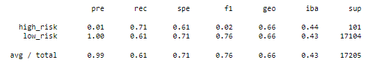
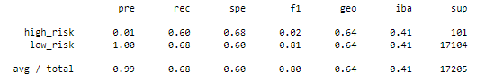
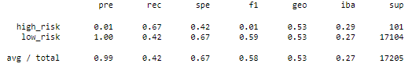
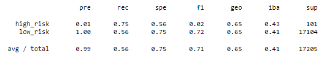
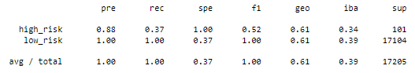
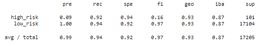

# credit-risk-analysis

## Overview
Utlizing machine learning to determine credit risk based on various factors related to previous loan applications. 

## Results

### Oversampling

#### Naive Random Oversampling
##### Classification Report

##### Balanced Accuracy Score
0.6631475238262834 &rarr; 66.3%
  
#### SMOTE Oversampling
##### Classification Report

##### Balanced Accuracy Score
0.6419006844557233 &rarr; 64.2%
  
### Undersampling

##### Classification Report

##### Balanced Accuracy Score
0.5451813715047837 &rarr; 54.5%
  
### Comination Over/Undersampling (SMOTEENN)
##### Classification Report

##### Balanced Accuracy Score
0.6550612907408608 &rarr; 65.5%
  
### Ensembles 

#### Balanced Random Forest Classifier
##### Classification Report

##### Balanced Accuracy Score
0.6830221521918328 &rarr; 68.3%
  
#### Easy Ensemble AdaBoost Classifier
##### Classification Report

##### Balanced Accuracy Score
0.9316600714093861 &rarr; 93.1%

## Summary

Most models fell between 64% and 69% accuracy. One model (Cluster Centroids Undersampling) performed notably worse (54.5%), and one model (Easy Ensemble AdaBoost Classifier) performing notably 
better (93.1%). However, even with a Balanced Accuracy Score of 93.1%, it should be noted that the F1 score for this model's High Risk classification was very poor (0.16). 
This is due to a low Precision score for the High Risk Classification. Given the current High Risk recall score (0.92), it might be possible to increase High Risk Precision Score without significantly reducing Recall. 
Doing this will likely raise the model's F1 score, resulting in a more reliable model.   

**Recommendation:** Utilize the Easy Ensemble AdaBoost Classifier (EEAC) model, with adjustments mentioned previously. As of the writing of this report, the EEAC model can be deployed for small-scale usage, but 
improvements will need to be made before the model can be used on a larger scale.  